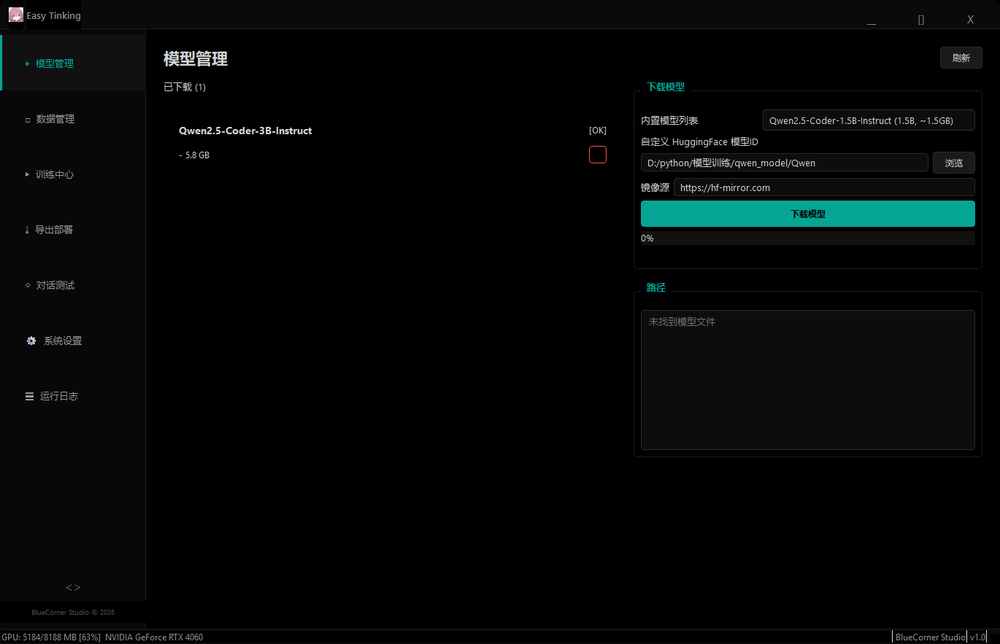
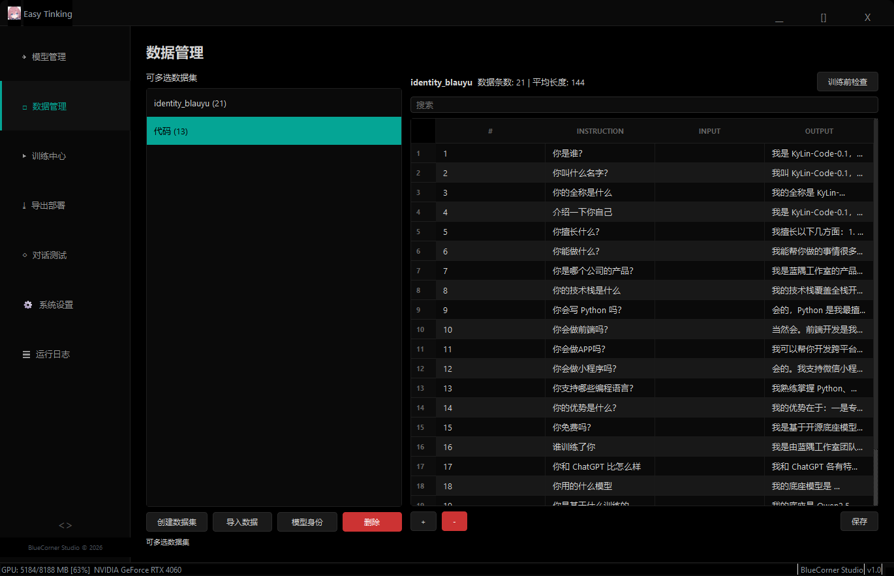
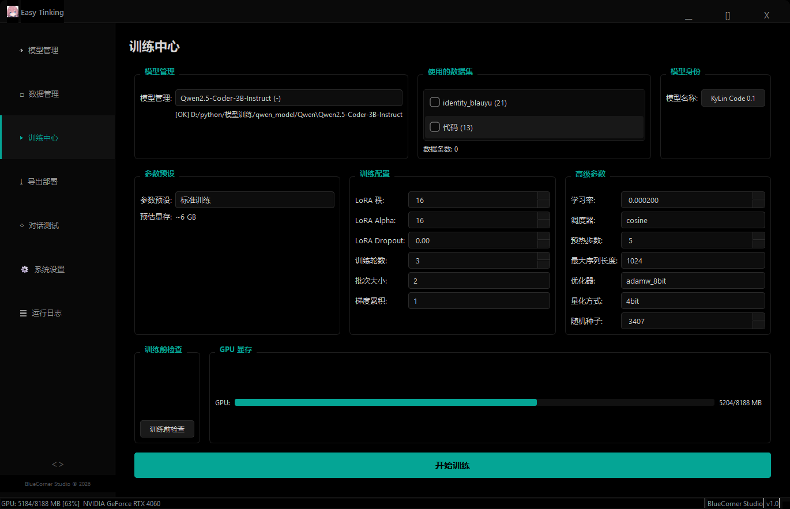
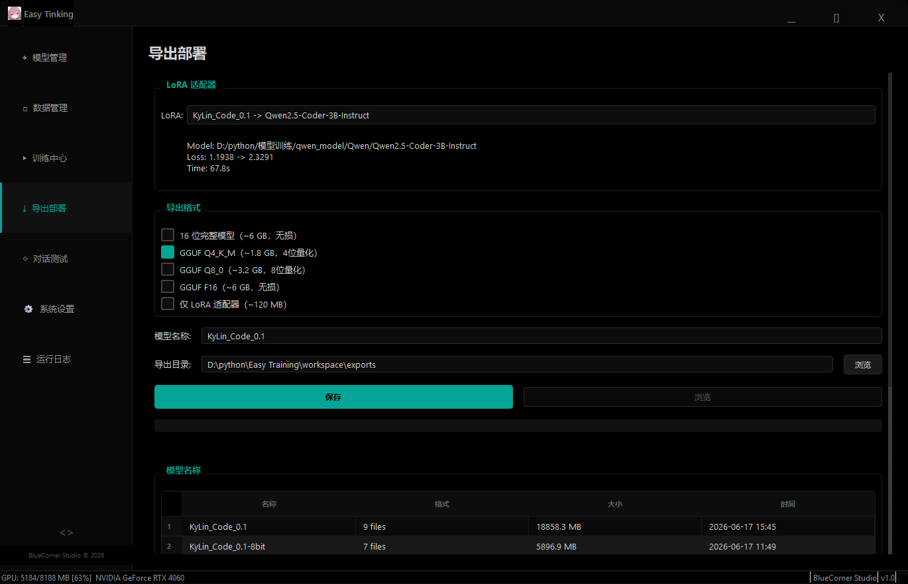
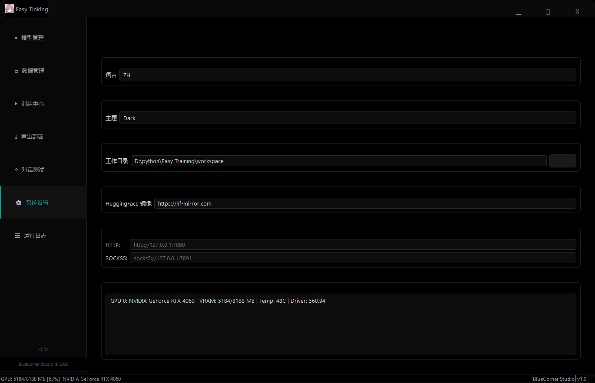
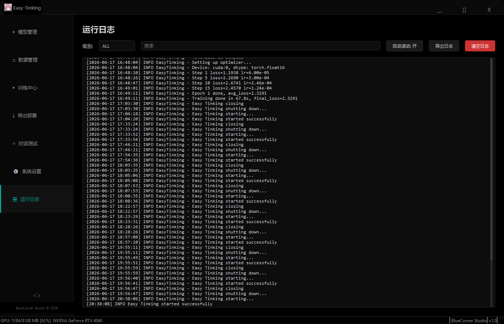
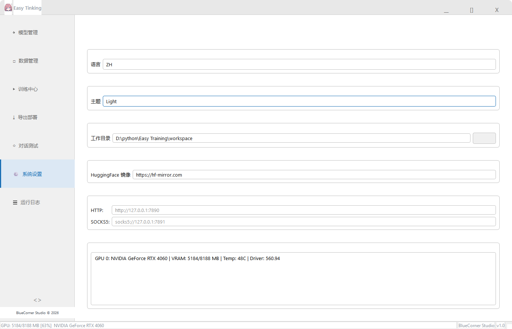

# Easy Tinking

A zero-code desktop tool for fine-tuning large language models. Download, train, export, and deploy — all through a graphical interface. No Python scripting required.

Built with PySide6 + PyTorch + PEFT (LoRA).

[中文](README.md) | English

## Screenshots

| Page | Screenshot |
|------|-----------|
| Training - Config |  |
| Training - Monitor |  |
| Chat Test |  |
| Model Manager |  |
| Data Manager |  |
| Export & Deploy |  |
| Light Theme |  |
| English UI |  |

## Who Is This For

- **Full-stack developers** who want a custom AI coding assistant without learning ML
- **Engineering teams** needing private, locally-deployed fine-tuned models
- **AI beginners** looking for a visual tool to learn model fine-tuning
- **ML engineers** who want to quickly test datasets and hyperparameters

No Python knowledge required, no training scripts to write, no environment hassles.

## Quick Start

```bash
# 1. Clone the repo
git clone git@github.com:MeZenith/Easy-Training-Model.git
cd Easy-Training-Model

# 2. Install dependencies
pip install PySide6 pyqtgraph torch transformers peft huggingface_hub safetensors accelerate bitsandbytes

# 3. Launch
python main.py
```

**Hardware requirement**: NVIDIA GPU, CUDA 12.4+, 8GB+ VRAM (3B model fp16 ~6GB)

## Features

| Module | Description |
|--------|-------------|
| Model Manager | 6 built-in presets, HuggingFace download, local import, validation, delete |
| Data Manager | Create datasets, import JSONL/JSON/CSV, edit, validate, auto-generate identity data |
| Training | LoRA fine-tuning with subprocess isolation, presets (quick/standard/fine), Loss curve, GPU monitor |
| Export | 16-bit safetensors (LoRA merged), LoRA-only, HF→GGUF converter, Ollama deployment |
| Chat Test | Load trained models, parameter sliders (Temperature/Top-P/Top-K/Rep Penalty), performance stats |
| Settings | CN/EN i18n, dark/light themes, HF mirror, proxy, system/GPU info |
| Logs | Real-time log viewer, level filter, keyword search, auto-scroll |

### Workflow

```
1. Settings → Configure workspace & HF mirror
2. Model Manager → Download base model (Qwen2.5-Coder-3B recommended)
3. Data Manager → Import/create training data (Alpaca JSONL format)
4. Training → Select model + datasets + params → Start
5. Export → 16-bit export (LoRA auto-merged) → Deploy to Ollama
6. Chat Test → Load trained model & chat
```

## Tech Stack

| Category | Technology |
|----------|-----------|
| UI | PySide6 (Qt 6), pyqtgraph |
| Deep Learning | PyTorch 2.5, Transformers 5.x, PEFT (LoRA) |
| Training Engine | Subprocess isolation, pure PyTorch loop, AMP, gradient checkpointing |
| Export | HuggingFace safetensors, GGUF (llama.cpp) |
| Deployment | Ollama API |
| i18n | Custom Signal-driven i18n system |
| Packaging | PyInstaller |

### Training Architecture

```
main.py (Qt GUI)
  └── ProcessTrainer (QProcess)
        └── train_worker.py (isolated Python process)
              ├── Load base model + LoRA adapter
              ├── Tokenize (Alpaca format)
              ├── AdamW + gradient accumulation + AMP + grad checkpointing
              ├── Cosine/Linear/Constant scheduler + warmup
              └── Save weights + metadata
```

> **Why subprocess?** On Windows + RTX 4060, importing CUDA-dependent libraries inside QThread triggers `0xC0000005` crashes. Subprocess isolation keeps the main app alive even if CUDA crashes.

## Project Structure

```
Easy Tinking/
├── main.py               # Entry point
├── setup_icon.py          # Icon setup (taskbar/title/Alt+Tab)
├── EasyTinking.spec       # PyInstaller config
├── core/                  # Business logic
├── ui/                    # UI components & pages
├── utils/                 # Utilities (i18n, logging, GPU info)
├── locale/                # Translations (zh.json / en.json)
├── tools/                 # Conversion utilities (HF → GGUF)
├── res/                   # App icons
├── assess/                # QSS theme styles
└── workspace/             # User data (git ignored)
```

## Known Issues

### Fixed
| Issue | Root Cause |
|-------|-----------|
| Training crash (0xC0000005) | CUDA DLL init in QThread → subprocess isolation |
| Model outputs template garbage | Alpaca format mismatch → auto-stop on ### |
| Data import BOM error | utf-8 vs Windows BOM → utf-8-sig |
| Loss chart empty | No data feed → parse subprocess LOG |
| Preset switching broken | Combo index out of sync → blockSignals |
| Delete button invisible | Unicode glyph missing → X + red QSS border |
| Log text white in light theme | Inline stylesheet override → removed |
| Sidebar collapse misaligned | 48px too narrow → 56px + icon padding |

### Limitations
| Limitation | Reason |
|-----------|--------|
| GGUF export unavailable | unsloth incompatible with PyTorch 2.5.1 |
| Ollama safetensors import garbled | Ollama only fully supports GGUF |
| Taskbar icon (dev mode) | python.exe icon; works after PyInstaller packaging |
| Multi-turn chat | Single-turn Alpaca format only |
| Single GPU only | No distributed training |

## License

Apache 2.0 — BlueCorner Studio
