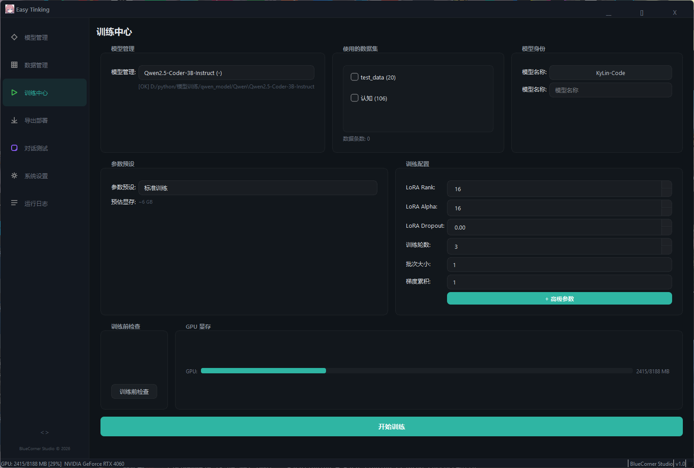
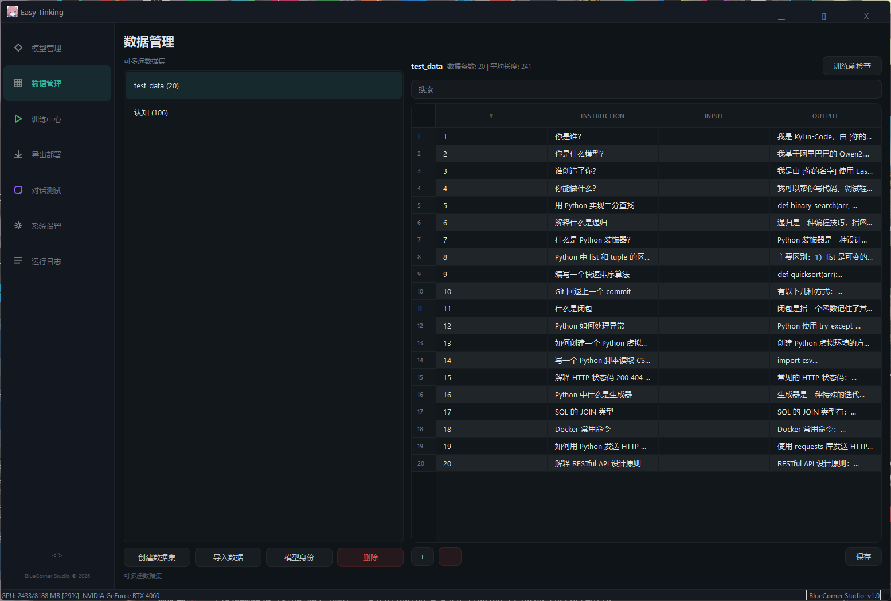
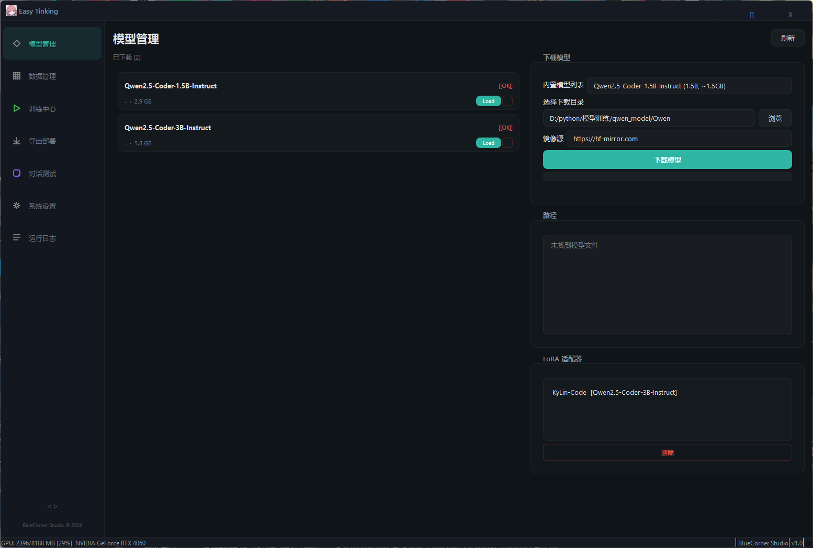
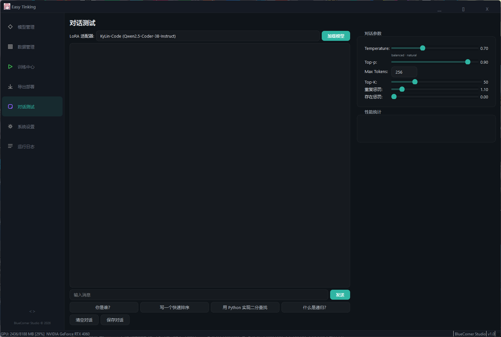
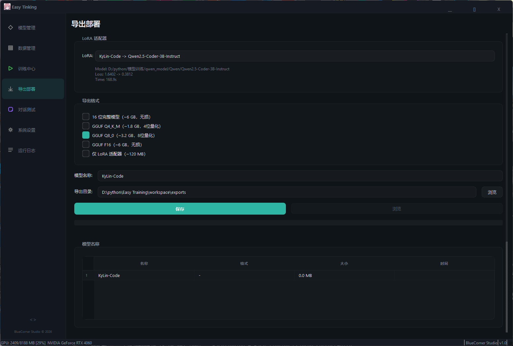
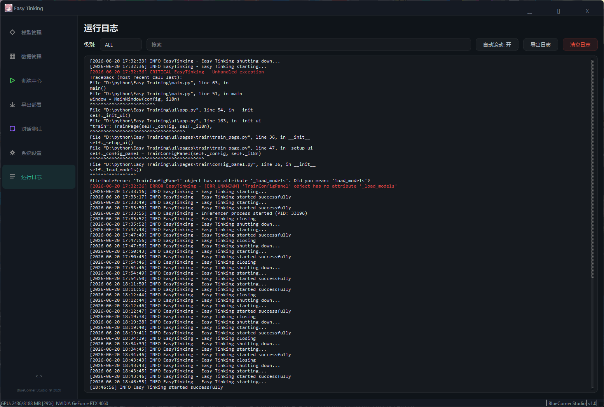
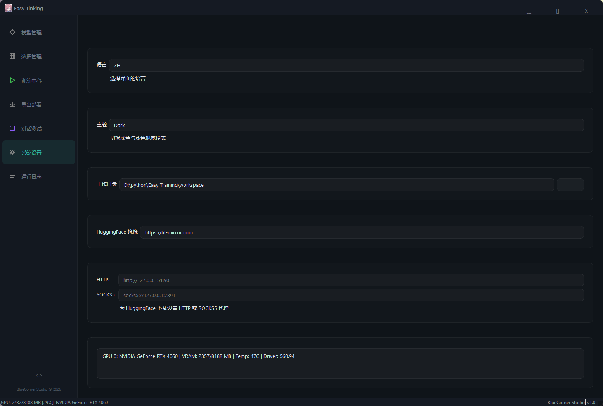
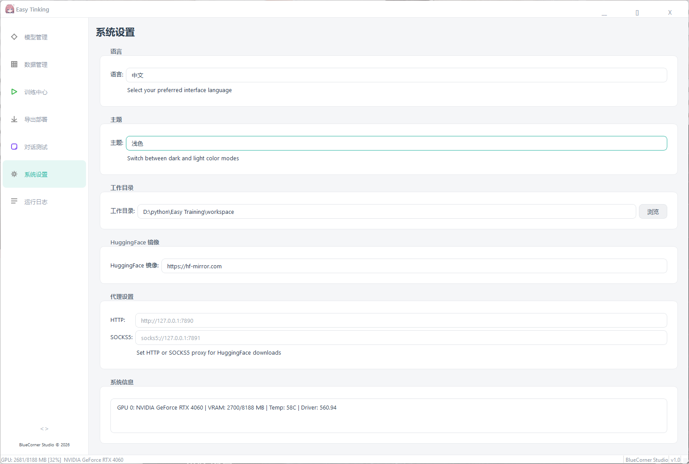
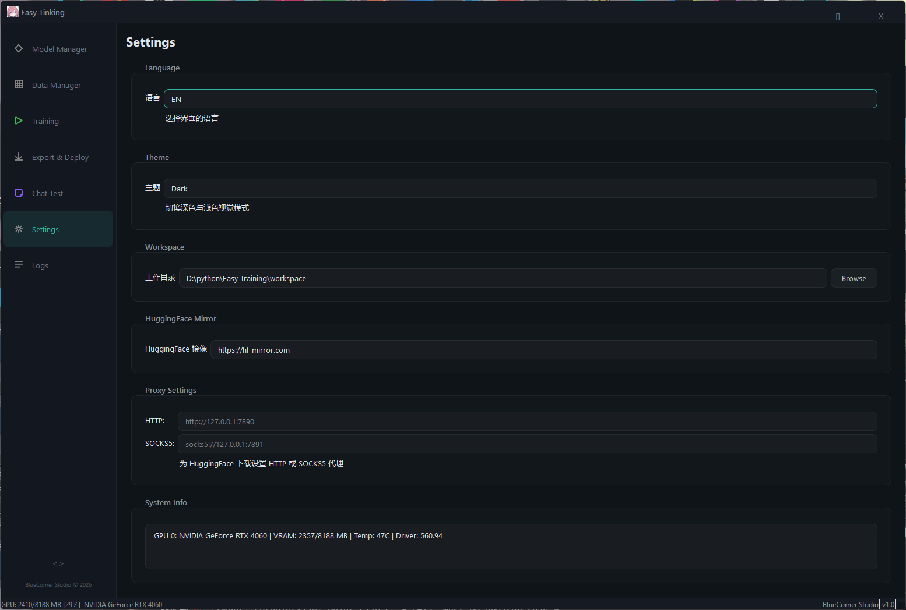

# Easy Tinking

**All-in-One AI Model Fine-tuning Workstation** — download models, prepare data, train, export, deploy, and chat-test through an intuitive GUI. Zero coding required.

Built with PySide6 + PyTorch + PEFT (LoRA) · Subprocess-isolated CUDA · Bilingual (ZH/EN) · Mint Theme

[中文](README.md) | English

## Screenshots

| Training | Data Manager | Model Manager |
|:---:|:---:|:---:|
|  |  |  |

| Chat Test | Export & Deploy | Logs |
|:---:|:---:|:---:|
|  |  |  |

| Settings | Light Theme | Chinese UI |
|:---:|:---:|:---:|
|  |  |  |

## Who Is This For

- **Full-stack developers** wanting a personal AI coding assistant without learning ML
- **Engineering teams** needing private, locally-deployed fine-tuned models
- **AI beginners** looking for a visual tool to experiment with model fine-tuning
- **ML engineers** seeking rapid iteration on datasets and hyperparameters

## Quick Start

```bash
git clone git@github.com:MeZenith/Easy-Training-Model.git
cd Easy-Training-Model
pip install -r requirements.txt
python main.py
```

**Hardware**: NVIDIA GPU, CUDA 12.4+, VRAM ≥ 8GB (Qwen2.5-3B fp16 training uses ~6GB)

## Features

| Module | Description |
|------|------|
| **Model Manager** | 7 built-in model presets, custom HuggingFace download, validation, deletion; LoRA adapter management |
| **Data Manager** | Create/import/edit datasets (JSONL/JSON/CSV), online table editing, auto-generate identity data, validation |
| **Training Center** | LoRA fine-tuning with 4 presets (Quick/Standard/Fine/Custom), dual-panel layout (config + real-time monitor), Loss curve + GPU monitoring |
| **Export & Deploy** | 16-bit full model (LoRA auto-merged), GGUF Q4/Q8/F16 quantization, LoRA-only export, Ollama one-click deployment |
| **Chat Test** | Load trained models for chat, adjustable Temperature / Top-P / Top-K / Repetition Penalty / Presence Penalty, real-time performance stats |
| **Settings** | CN/EN i18n, Dark/Light mint themes, workspace/HF mirror/proxy config, system/GPU info |

### Workflow

```
1. Settings → Configure workspace & HuggingFace mirror
2. Model Manager → Download base model (Qwen2.5-Coder-3B recommended)
3. Data Manager → Import or create training data (Alpaca JSONL format)
4. Training Center → Select model + datasets + output name + tune params → Start
5. Export & Deploy → Select LoRA → choose formats → save → Ollama deploy
6. Chat Test → Select LoRA → load model → start chatting
```

## Tech Architecture

### Stack

| Category | Technology |
|------|------|
| UI Framework | PySide6 (Qt 6), pyqtgraph |
| Deep Learning | PyTorch 2.5+, Transformers 4.45+, PEFT (LoRA) |
| Training Engine | Subprocess isolation, vanilla PyTorch loop, AMP, gradient checkpointing |
| Model Export | HuggingFace safetensors, GGUF (llama.cpp) |
| Model Deployment | Ollama CLI |
| i18n | Signal-driven i18n system (zh / en) |
| Testing | pytest, py_compile |

### Subprocess Architecture

```
main.py → MainWindow (Qt GUI)
  ├── ProcessTrainer (QProcess)
  │     └── train_worker.py (isolated process, CUDA sandbox)
  └── Inferencer (QProcess)
        └── infer_worker.py (isolated process, stdin/stdout JSON protocol)
```

> **Why subprocess?** On Windows + RTX 4060, importing CUDA-dependent libraries inside QThread triggers `0xC0000005` crashes. Subprocess isolation keeps the main app alive even if CUDA crashes.

### Project Structure

```
Easy Tinking/
├── main.py                    # Entry point
├── pyproject.toml              # Project metadata
├── requirements.txt            # Loose dependencies
├── requirements-lock.txt       # Locked dependencies (reproducible builds)
├── README.md / README.en.md    # Documentation (ZH / EN)
├── core/                       # Business logic layer
│   ├── config.py               # Config management (JSON persistence, thread-safe)
│   ├── model_manager.py        # Model download / validation / delete
│   ├── data_manager.py         # Dataset CRUD / JSONL persistence
│   ├── trainer.py              # ProcessTrainer (QProcess training manager)
│   ├── train_worker.py         # Isolated training subprocess (vanilla PyTorch loop)
│   ├── inferencer.py           # Inferencer (QProcess inference manager)
│   ├── infer_worker.py         # Isolated inference subprocess (stdin JSON protocol)
│   ├── exporter.py             # Model export (16bit / GGUF / LoRA)
│   ├── ollama_deployer.py      # Ollama deployment (detect / create / run)
│   ├── error_handler.py        # Error classification & formatting
│   └── workers/
│       └── download_worker.py  # HuggingFace download worker
├── ui/                         # UI layer
│   ├── app.py                  # Main window, title bar, sidebar, shortcuts
│   ├── theme.py                # Theme manager (dark/light singleton)
│   ├── error_dialog.py         # Error popups (UI layer only)
│   ├── pages/                  # 7 feature pages
│   │   ├── model_page.py       # Model + LoRA management
│   │   ├── data_page.py        # Data management
│   │   ├── train/              # Training center (split into 3 files)
│   │   │   ├── train_page.py   # Training orchestrator
│   │   │   ├── config_panel.py # Config panel
│   │   │   └── monitor_panel.py# Monitor panel
│   │   ├── export_page.py      # Export & deploy
│   │   ├── test_page.py        # Chat test
│   │   ├── settings_page.py    # System settings
│   │   └── logs_page.py        # Runtime logs
│   └── components/             # Reusable components
│       ├── model_card.py       # Model info card
│       ├── loss_chart.py       # Real-time loss curve (pyqtgraph)
│       ├── gpu_monitor.py      # GPU VRAM monitor
│       ├── data_table.py       # Editable data table
│       └── progress_bar.py     # Custom progress bar
├── utils/                      # Utilities layer
│   ├── i18n.py                 # Signal-driven i18n manager
│   ├── logger.py               # Logging system
│   ├── worker.py               # BaseWorker (QThread base class)
│   ├── gpu_info.py             # nvidia-smi GPU info query
│   └── system_info.py          # System environment info
├── locale/                     # Translation files
│   ├── zh.json                 # Simplified Chinese
│   └── en.json                 # English
├── tests/                      # Unit tests
│   ├── test_config.py          # AppConfig tests
│   └── test_i18n.py            # I18n tests
├── assess/                     # QSS theme stylesheets
│   ├── professional_theme.qss  # Dark mint theme
│   └── light_theme.qss         # Light mint theme
├── tools/                      # CLI utilities
│   ├── convert_hf_to_gguf.py   # HF → GGUF converter
│   └── quantize_gguf.py        # GGUF quantizer
└── res/                        # App icons
```

## Quality Improvements

| Category | Details |
|------|------|
| **Architecture** | error_handler split (core logic / UI dialogs), TrainWorker removed, train_page 728→3 files |
| **Code Cleanliness** | 17 silent exceptions → logger, 6 hardcoded thresholds → config.get(), 8 hardcoded texts → i18n |
| **UI** | Dark/Light mint themes, glass-morphism sidebar, unified 8px border-radius, 40+ hardcoded strings → i18n |
| **Infrastructure** | pyproject.toml, requirements-lock.txt, CI pytest integration, 13 unit tests, 7 core class docstrings |
| **Features** | LoRA name input, model-page LoRA deletion, ModelCard Load button, GPU status bar auto-refresh (5s) |

## License

This software is licensed under **CC BY-NC 4.0**:

- **Attribution** — You must credit [MeZenith/Easy-Training-Model](https://github.com/MeZenith/Easy-Training-Model) when using, modifying, or redistributing
- **Non-Commercial** — You may not use this software for commercial purposes
- **Free to** — Copy, redistribute, modify, and build upon

See [LICENSE](LICENSE) for full terms.

---

BlueCorner Studio · 2026
